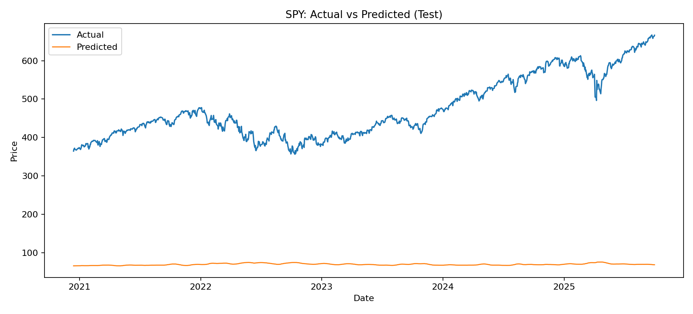
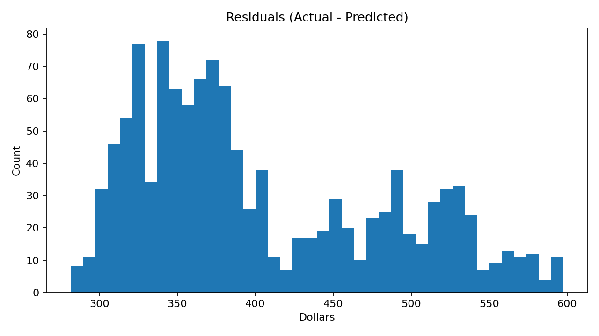
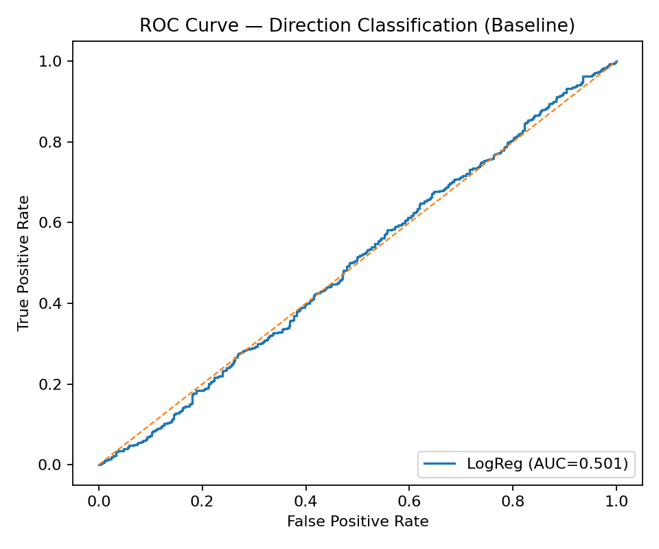
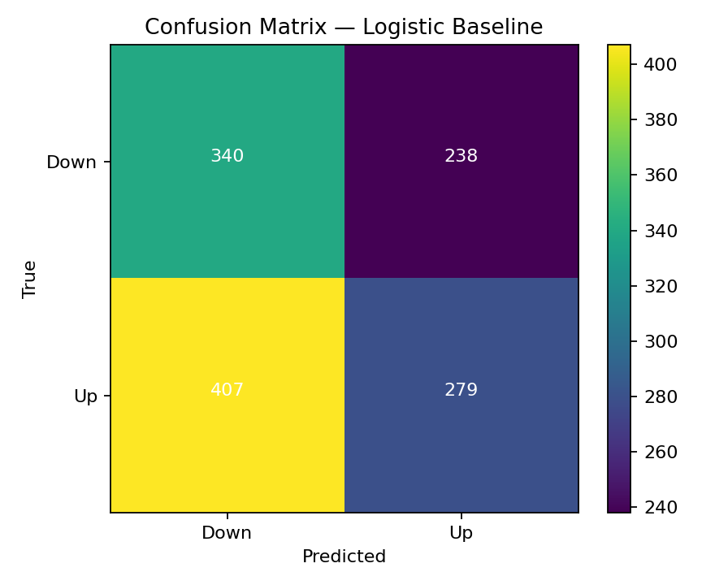

# Forecasting SPY with LSTMs: Price Regression & Direction Classification

## 📌 Project Summary
This project builds and evaluates **Long Short-Term Memory (LSTM)** neural networks for forecasting the **SPY ETF** using historical OHLCV data and technical indicators (moving averages, RSI, MACD, Bollinger Bands).

Two complementary tasks are tackled:

1. **Regression — Predicting the next-day closing price**
   - Evaluated with RMSE, MAE, and MAPE.
   - Compared against naïve and linear baselines.

2. **Classification — Predicting the next-day market direction (up vs down)**
   - Evaluated with Accuracy, Precision, Recall, F1, and ROC-AUC.
   - Compared against logistic regression and majority-class baselines.

The pipeline includes:
- Chronological data splitting (no leakage).
- Feature scaling with separate fit for train/test.
- 60-day rolling windows as input sequences.
- LSTM architectures tuned for each task.
- Visualizations of predicted vs actual prices and classification performance.

**Key Outcome**  
The models demonstrate that while LSTMs capture some temporal structure in SPY data, forecasting financial markets remains challenging—results highlight the importance of rigorous baselines, leakage prevention, and careful evaluation.

---

## ✅ Implemented Steps

- **Clean split (no leakage):** Scaler is fit only on training data, then applied to validation/test sets.  
- **Separate tracks:** Regression (predict price) and Classification (predict direction) are handled in distinct sections.  
- **Baselines:** Added naïve predictor for regression and logistic regression for classification.  
- **Evaluation plots:** Residuals histogram for regression, ROC curve and confusion matrix for classification — all saved as PNGs in `/artifacts/`.  
- **README text printer:** Notebook generates Markdown-ready results and links for easy pasting into this README.  
- **Stretch (returns):** Experimental return-prediction pipeline included for more stable modeling.  

---

## 📊 Results

### Regression
- **LSTM:** RMSE = `XX.X` | MAE = `YY.Y`  
- **Naïve baseline:** RMSE = `AA.A` | MAE = `BB.B`  

  

### Classification (Baseline)
- **Logistic Regression:** ROC-AUC = `0.XX`  

  

---

## ⚙️ Tech Stack
- Python, NumPy, Pandas  
- TensorFlow / Keras (LSTM)  
- Scikit-learn  
- Matplotlib, Plotly (with Kaleido for static saves)  
- Alpha Vantage API 

---
